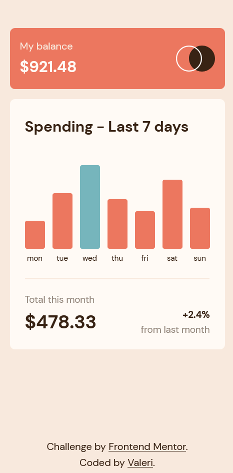
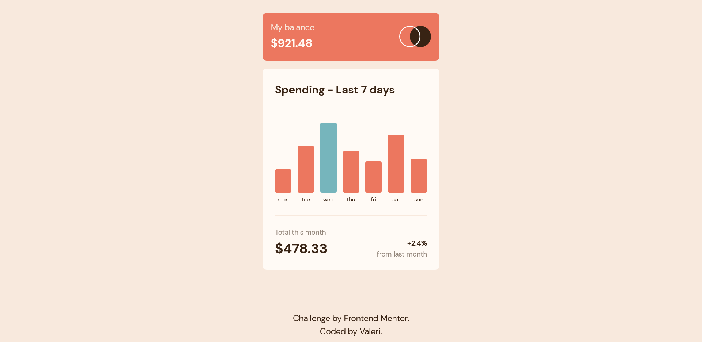

# Frontend Mentor - Expenses chart component solution

This is a solution to the [Expenses chart component challenge on Frontend Mentor](https://www.frontendmentor.io/challenges/expenses-chart-component-e7yJBUdjwt). Frontend Mentor challenges help you improve your coding skills by building realistic projects.

## Table of contents

-   [Overview](#overview)
    -   [The challenge](#the-challenge)
    -   [Screenshot](#screenshot)
    -   [Links](#links)
-   [My process](#my-process)
    -   [Built with](#built-with)
-   [Author](#author)

## Overview

### The challenge

Users should be able to:

-   View the bar chart and hover over the individual bars to see the correct amounts for each day
-   See the current day’s bar highlighted in a different colour to the other bars
-   View the optimal layout for the content depending on their device’s screen size
-   See hover states for all interactive elements on the page
-   **Bonus**: Use the JSON data file provided to dynamically size the bars on the chart

### Screenshot

#### Mobile design

#### Desktop design

### Links

-   Solution URL: [Expenses chart component solution](https://your-solution-url.com)
-   Live Site URL: [Expenses chart component](https://your-live-site-url.com)

## My process

### Built with

-   Semantic HTML5 markup
-   CSS custom properties
-   Flexbox
-   CSS Grid
-   Mobile-first workflow
-   [React](https://reactjs.org/) - JS library
-   [Typescript](https://www.typescriptlang.org/) - Superset of JavaScript
-   [SASS](https://sass-lang.com/) - CSS Preprocessor
-   [PostCss](https://postcss.org/) - A tool for transforming CSS with JavaScript
-   [Autoprefixer](https://github.com/postcss/autoprefixer) - PostCSS plugin which parses your CSS and adds vendor prefixes
-   [CSS Modules](https://github.com/css-modules/css-modules) - For styles
-   [Styled Components](https://styled-components.com/) - For styles
-   [Vite](https://vitejs.dev/) - Next Generation Frontend Tooling
-   [PnPm](https://pnpm.io/) - Fast, disk space efficient package manager

## Author

-   Frontend Mentor - [Valeri](https://www.frontendmentor.io/profile/Valeri85)
-   Twitter - [Valeri](https://twitter.com/Valeri79125128)
